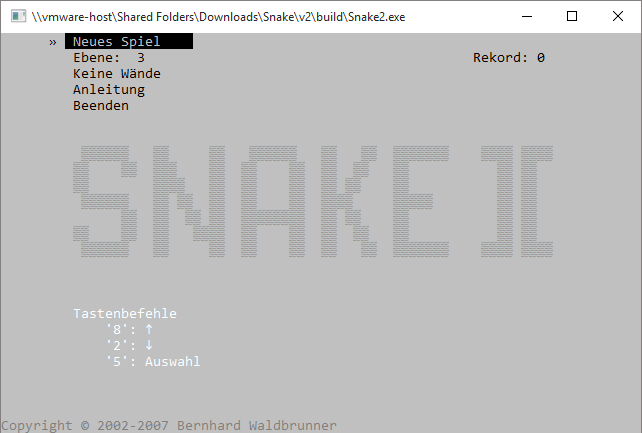
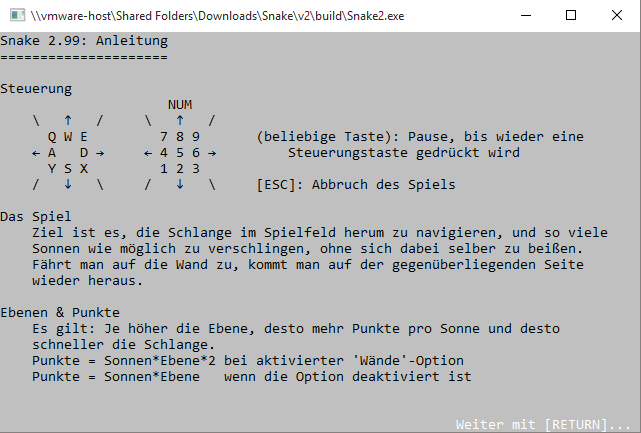
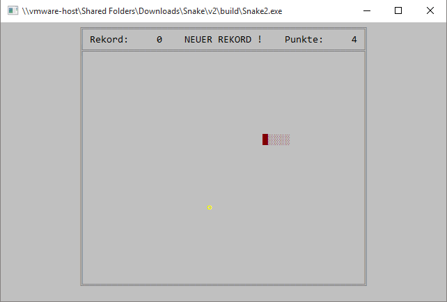

# Snake 2 & Snake 2 beta

## Installation
First, [download cc3250mt.dll](http://www.dlldownloader.com/cc3250mt-dll) and move it into the `build` folder, then run `build/Snake2.exe`.

## Screenshots

